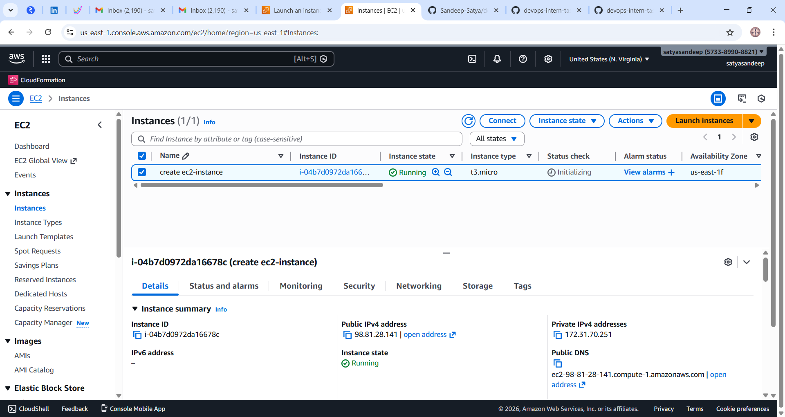
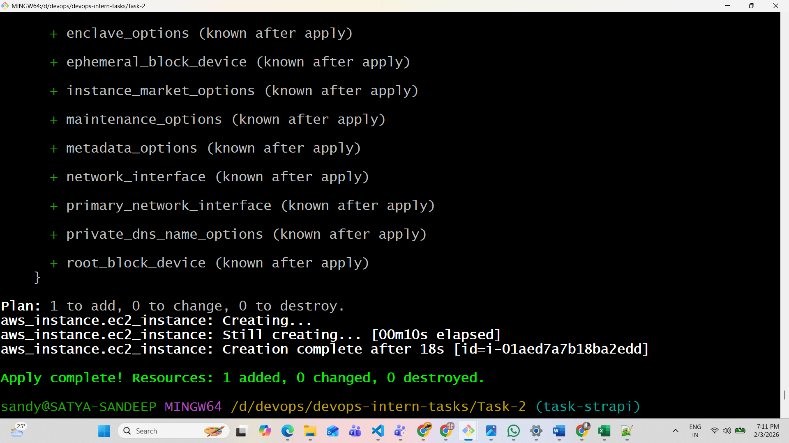
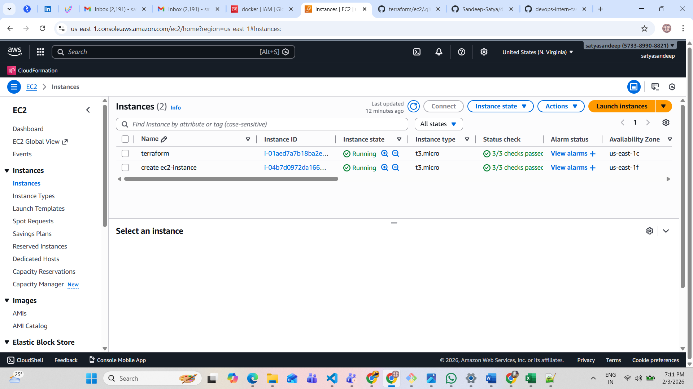

AWS EC2 Deployment Using Terraform

Project Overview

This project demonstrates the understanding of AWS core services and Infrastructure as Code (IaC) using Terraform. It includes manual provisioning of an EC2 instance using the AWS Management Console and automated provisioning of an EC2 instance using Terraform. The objective is to gain hands-on experience with cloud infrastructure deployment and automation.

Tools and Technologies
AWS Cloud Platform
Amazon EC2
Terraform
AWS CLI
Git and GitHub
Git Bash / Command Line

AWS Core Concepts
EC2 (Elastic Compute Cloud)
Amazon EC2 provides scalable virtual servers that can be launched and managed on demand.

AMI (Amazon Machine Image)
AMI is a template that contains the operating system and configuration required to launch EC2 instances.

Security Groups
Security groups act as virtual firewalls that control inbound and outbound traffic to instances.

Key Pair
Key pairs are used for secure SSH authentication to EC2 instances.

IAM (Identity and Access Management)
IAM is used to manage users, roles, and permissions in AWS.

Part 1: Manual EC2 Instance Creation

Configure EC2 Instance
Configure the following options:

Name: manual-ec2-instance
AMI: Amazon Linux 2
Instance Type: t2.micro (Free Tier Eligible)
Key Pair: Create or select an existing key pair
Security Group: Allow SSH (port 22) and HTTP (port 80)

Launch Instance
Click on Launch Instance to create the EC2 server.

Verify Instance
Go to the EC2 dashboard and verify that the instance state is Running.

EC2 Provisioning Using Terraform
Step 1: Install Terraform
Download Terraform from the official website:

https://developer.hashicorp.com/terraform/downloads

Verify installation:

terraform -version

Step 2: Install and Configure AWS CLI
Install AWS CLI:

https://aws.amazon.com/cli/

Configure AWS credentials:

aws configure

Enter the following details:

AWS Access Key
AWS Secret Key
Default Region (example: ap-south-1)
Output Format: json
Step 3: Create Terraform Project Directory
Create directory:

mkdir terraform
cd terraform

Create Terraform configuration file:

vi main.tf

Step 4: Terraform Configuration
Add the following code inside main.tf:

provider "aws" {
  region = "us-east-1"
}

resource "aws_instance" "ec2_instance" {
  ami           = "ami-0532be01f26a3de55"
  instance_type = "t2.micro"
  key_name      = "terraform"

  tags = {
    Name = "terraform-ec2-instance"
  }
}

Step 5: Initialize Terraform
terraform init

This command downloads the required provider plugins.

Step 6: Validate Terraform Configuration
terraform validate

Step 7: Preview Infrastructure Plan
terraform plan

This shows the resources that will be created.

Step 8: Apply Terraform Configuration
terraform apply

Type yes when prompted to create the EC2 instance.

Step 9: Verify EC2 Instance
Open AWS Console → EC2 Dashboard

Verify that the instance named terraform-ec2-instance is running.

Step 10: Destroy Infrastructure
To avoid unnecessary AWS charges, destroy resources after testing:

terraform destroy

Type yes to confirm.

GitHub Repository Setup
Initialize Git Repository
git init

Create .gitignore File
Add the following entries to avoid committing large and sensitive files:

.terraform/
terraform.tfstate
terraform.tfstate.backup
*.exe

Commit Changes
git add .
git commit -m "Add Terraform EC2 configuration"

Push Code to GitHub
git remote add origin 
git branch -M main
git push -u origin main

Final Outcome
Successfully launched EC2 instance manually using AWS Console
Provisioned EC2 instance using Terraform
Understood Infrastructure as Code workflow
Maintained project version control using GitHub
Created proper technical documentation

